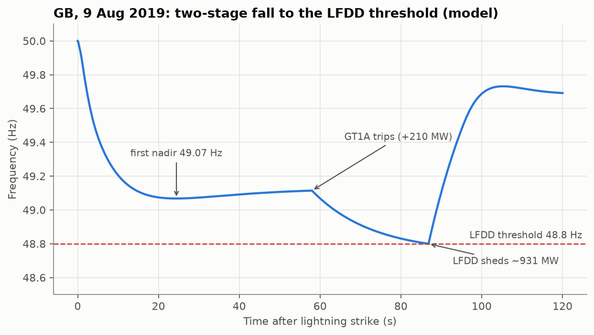
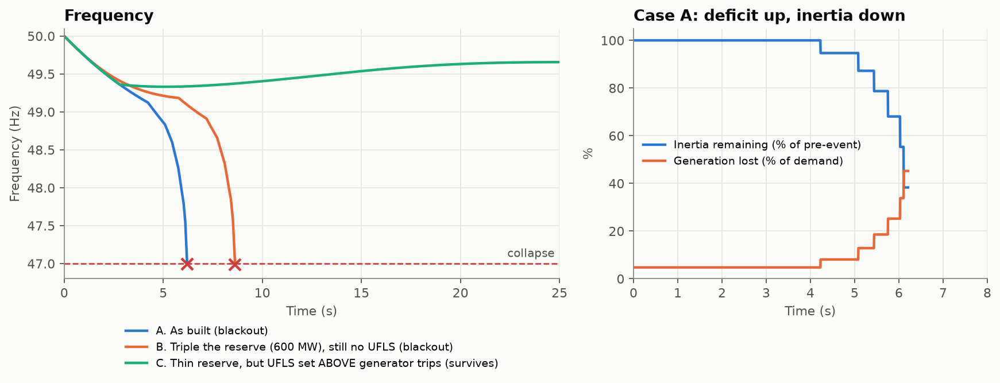
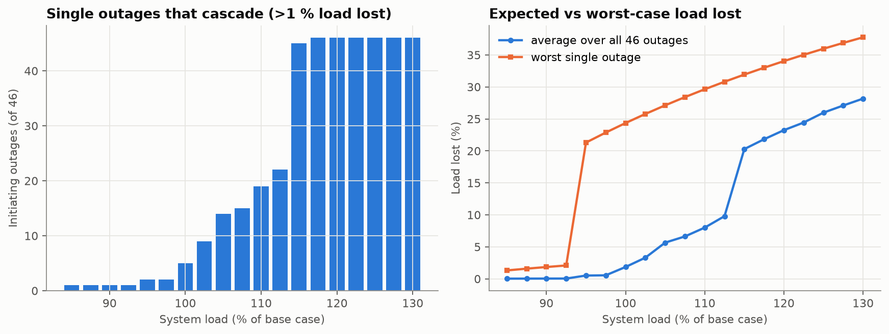
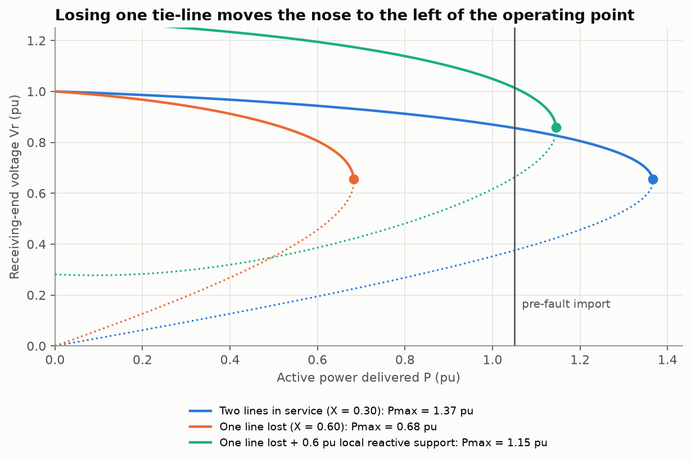
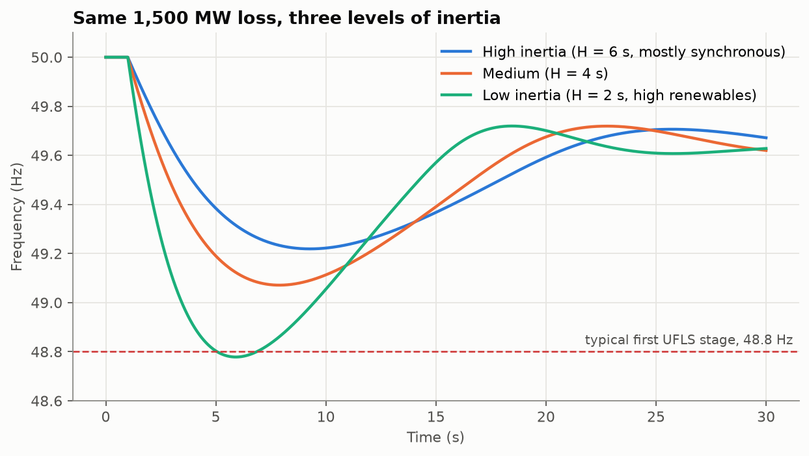

# Grid Failures Simulation Lab

Companion code for the book **Biggest Power Grid Failures: Engineering Analysis of History's Most Severe Blackouts, Cascades, and Grid Failures** by **Ganesh Kumar Pandey**.

The book explains *why* grids collapse. This repository lets you *run* the mechanisms: change the inertia, the reserve, a relay setting or the loading, and watch a stable grid turn into a blackout (or not).

**Get the book:** [Amazon](https://www.amazon.com/dp/B0HLGCRTTH) · Paperback and Kindle



## Notebooks

| # | Notebook | Book chapter | What you see |
|---|---|---|---|
| 01 | [Inertia and RoCoF](notebooks/01_inertia_and_rocof.ipynb) | Ch. 2 (Fig. 2.1) | Same generation loss, three inertia levels; only the low-inertia grid reaches load shedding |
| 02 | [UK, 9 Aug 2019](notebooks/02_uk_2019_lfdd.ipynb) | Ch. 9 | Correlated losses beat an N-1 reserve; what-if: which fix avoids LFDD |
| 03 | [Pakistan, Jan 2023](notebooks/03_pakistan_2023_uf_cascade.ipynb) | Ch. 8 | Under-frequency cascade; why more reserve does not help but coordinated UFLS does |
| 04 | [Cascade on IEEE 39-bus](notebooks/04_cascade_ieee39.ipynb) | Ch. 2, 5, 18 | Overload, trip, redistribute; the "cliff edge" as loading rises |
| 05 | [Voltage collapse, Italy 2003](notebooks/05_voltage_collapse_italy.ipynb) | Ch. 2, 7 | P-V nose curves; losing one tie-line puts the import beyond the nose |

All notebooks are committed **with outputs**, so you can read them on GitHub without running anything.

| | |
|---|---|
|  |  |
|  |  |

## The `gridfail` package

Three small, readable modules (plain NumPy, no black boxes):

- `gridfail/frequency.py`: aggregated swing-equation model with primary and fast (battery) reserve, load damping, generator under-frequency trips and UFLS/LFDD stages
- `gridfail/cascade.py`: quasi-static thermal cascade with DC power flow, island detection and load shedding, on the IEEE 39-bus system (network data via `pandapower`)
- `gridfail/voltage.py`: two-bus P-V nose curves and maximum loadability

```python
from gridfail.frequency import FreqSystem, GenLoss, ShedStage, simulate

s = FreqSystem(demand_mw=29000, ek_mws=210000, reserve_mw=1000,
               losses=[GenLoss(0, 1481, label="correlated losses")],
               shed_stages=[ShedStage(48.8, 931, label="LFDD")])
r = simulate(s, t_end=60)
print(r["f"].min())
```

## Run it

```bash
git clone https://github.com/<your-username>/grid-failures-sim.git
cd grid-failures-sim
pip install -r requirements.txt
jupyter lab notebooks/
```

**Prefer plain Python files?** Every notebook also exists as a script in `scripts/`. Open any of them (for example `scripts/02_uk_2019_lfdd.py`) and press Run, or run `python run_all.py` to go through all five. Close each chart window to move to the next.

To rebuild every notebook, script and figure from scratch: `python tools/build_notebooks.py`

## Important: these are teaching models

Every model here is deliberately simple so the mechanism stays visible. Parameters are chosen to be plausible and to reproduce the **shape** of each reported event, not to replicate any system operator's measured data. Notebook 03 uses a synthetic generator fleet because no unit-level public data exists for that event. For the authoritative record of any blackout, read the official reports listed in the book's references.

## Who this is for

Power systems students, protection and operations engineers, and anyone who read the book and wants to push the buttons themselves. Issues and pull requests (new case studies, better models) are welcome.

## Author

**Ganesh Kumar Pandey**, PhD researcher, Department of Electrical Engineering, IIT Kharagpur. Research on smart grids, AI for power systems, P2P energy trading and EV charging coordination.

## License

Code: MIT (see `LICENSE`). The book text and its figures are **not** included here and remain © 2026 Ganesh Kumar Pandey, all rights reserved.
